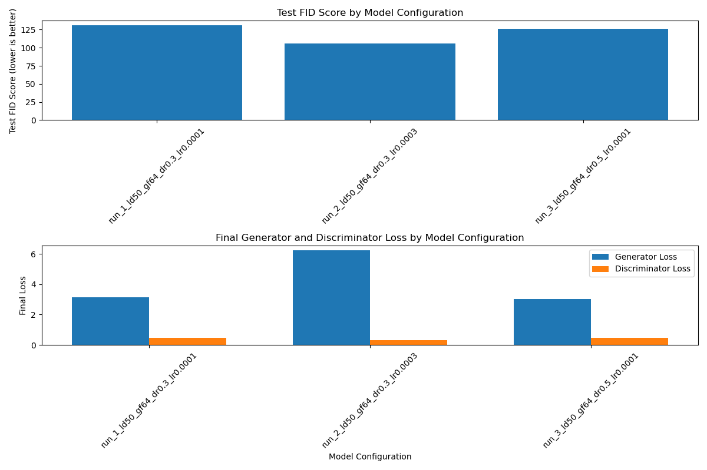
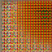

# 🍰 Pixel Pastries: GAN-based Dessert Dream Machine

Welcome to **Pixel Pastries**, a generative deep learning project that creates fantasy dessert images using a custom-built Generative Adversarial Network (GAN). This project focuses on generating **original**, **aesthetically pleasing**, and **realistic** desserts—ranging from cakes and cookies to donuts and beyond.

## 📸 Dataset

We use a **filtered subset of the [Food-101 dataset](https://data.vision.ee.ethz.ch/cvl/datasets_extra/food-101/)**, selecting only dessert-related classes (e.g., cakes, cookies, donuts, brownies). The goal is to focus purely on dessert imagery for training.

To create the custom dessert dataset, run:

```bash
python dataset_creation.py
```

This script filters the raw Food-101 dataset for use

## 🧠 Model Architecture
The project implements a custom GAN built from scratch using TensorFlow and Keras:

**Generator**: Learns to create realistic dessert images from noise.

**Discriminator**: Learns to distinguish between real dessert images and those generated by the Generator.

Both models are implemented in gan_model.py and are trained adversarially.

## Features:
Stable training with custom loss functions

Periodic evaluation using FID (Fréchet Inception Distance)

Image saving and GIF generation over epochs

Model checkpointing


## 🔍 Hyperparameter Tuning
Hyperparameter tuning is done using Grid Search to find optimal settings for:

Learning rate

Batch size

Optimizer type

Number of filters in Generator/Discriminator

All tuning logic is implemented using Grid Search.

## 📈 MLOps Integration
We use TensorBoard and Weights & Biases (wandb) to track experiments, log metrics, visualize training progress, and compare runs.

Tracked Metrics:

Generator loss

Discriminator loss

FID score

Example outputs (logged as images)

Checkpointed models

## 🧪 Evaluation
The trained model is evaluated using:

FID Score on validation and test sets

Visual inspection of generated images

Latent space interpolation (e.g., from cake to donut)

🗂️ Project Structure
```text
Pixel-Pastries/
├── dataset_creation.py        # Script to prepare and filter the dessert dataset
├── config.py                  # Configuration file for constants, paths, and hyperparameters
├── data_utils.py              # Data loading, preprocessing, and utility functions (e.g., logging, image saving)
├── models.py                  # Generator and Discriminator model definitions
├── metrics.py                 # Loss functions, FID calculation, and evaluation metrics
├── training.py                # Training loop with logging, checkpointing, and visualization
├── grid_search.py             # Grid search logic for hyperparameter tuning
├── main.py                    # Entry point script that integrates all components
├── training_progress.gif      # Gif of the training progress images generated
├── gid_search_results.csv     # Results of the Grid Search Performed
├── requirements.txt           # Python dependencies for the project
└── README.md                  # Documentation file describing the project

```

## 📦 Installation
To get started, clone the repo and install dependencies:
```bash
git clone https://github.com/pavankonam/pixel-pastries.git
cd pixel-pastries
pip install -r requirements.txt
```
Make sure you have Python 3.8+ and a GPU-enabled environment (optional but recommended for training).

## 📋 Requirements
Here are the required Python packages:
``` text
# requirements.txt

tensorflow==2.15.0
keras==2.15.0
numpy
matplotlib
imageio
wandb
sklearn
pandas
```

## 🌟 Output
Below is the comparision results of the Grid Search Performed:



Here’s an gif of how the images were generated for the best hyperparameters in GIF Format:




